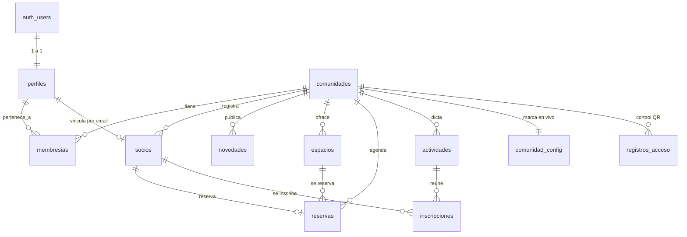

# Arquitectura de NODO

> Trabajo Anual UMAI · Entrega 6 · v1 (1/9/2026)
> Versión visual: https://claude.ai/code/artifact/453b45db-9764-4d30-88ca-45fef6322e27

## 1. Panorama

NODO es una **PWA** (app web instalable) que corre en el navegador y habla con un
backend gestionado. No hay servidor propio.

- **Frontend:** React 18 + Vite 5.
- **Backend:** Supabase — PostgreSQL expuesto como REST automática (PostgREST) con
  **Row Level Security** en la base, + Auth + Realtime + Storage.
- **Hosting / CI:** Vercel + GitHub Actions. Cada push corre lint + formato + build;
  cada merge a `main` se publica solo.
- **Modo demo:** sin credenciales de Supabase la app cae a datos de ejemplo en memoria
  (Zustand + mock). Sirve para desarrollo, evaluación y demos sin conexión.

| Capa         | Tecnología                                       |
| ------------ | ------------------------------------------------ |
| UI           | React 18, Vite 5                                 |
| Estilos      | Tailwind CSS 3 (tokens)                          |
| Estado       | Zustand                                          |
| Animación    | Framer Motion (respeta `prefers-reduced-motion`) |
| Backend      | Supabase (Postgres + Auth + Realtime + Storage)  |
| API          | PostgREST (REST automática con RLS)              |
| PWA          | Manifest + Service Worker                        |
| Hosting / CI | Vercel + GitHub Actions                          |

## 2. Modelo de datos

Todo cuelga de `comunidades` (el inquilino) y de `perfiles` (la persona, 1:1 con
`auth.users`). `membresias` es la tabla puente que da el **rol** de cada persona en
cada comunidad.

| Tabla              | Qué guarda                                                                          |
| ------------------ | ----------------------------------------------------------------------------------- |
| `comunidades`      | Cada club / centro cultural. Clave: slug legible (`la-union`).                      |
| `perfiles`         | Persona logueada. Se crea por trigger al registrarse. `id` = `auth.users.id`.       |
| `membresias`       | Rol (`socio` \| `superadmin` \| `deportes` \| `talleres`) por (perfil, comunidad).  |
| `socios`           | Ficha del socio en una comunidad. `perfil_id` opcional (vínculo con la cuenta).     |
| `espacios`         | Canchas / salas. `horario` es JSON (apertura, cierre, duración, días).              |
| `reservas`         | Turno de un socio en un espacio. Índice único evita doble reserva.                  |
| `actividades`      | Talleres / cursos de la comunidad. `dias` es JSON; `cupo_maximo` limita inscriptos. |
| `inscripciones`    | Socio anotado en una actividad. Índice único + trigger de cupo en la base.          |
| `novedades`        | Comunicados de la comunidad.                                                        |
| `comunidad_config` | Logo + nombre "en vivo", sincronizados por Realtime.                                |
| `registros_acceso` | Historial de escaneos de QR en la puerta.                                           |

Migraciones versionadas en `supabase/migrations/`, numeradas y aplicadas en orden.

## 3. Multi-tenant y seguridad

El aislamiento entre comunidades **lo hace PostgreSQL**, no el frontend. Cada tabla
con datos de comunidad tiene políticas RLS que se apoyan en 3 funciones
(`SECURITY DEFINER` para evitar recursión contra `membresias`):

| Función                    | `true` si el usuario…                     |
| -------------------------- | ----------------------------------------- |
| `es_miembro(comunidad)`    | tiene membresía activa (cualquier rol)    |
| `es_admin(comunidad)`      | rol `superadmin`, `deportes` o `talleres` |
| `es_superadmin(comunidad)` | rol exactamente `superadmin`              |

Flujo de una consulta: `supabase.from('socios')` + JWT → PostgREST arma el SQL →
Postgres aplica la política (`using ( es_admin(comunidad_id) OR perfil_id = auth.uid() )`)
→ devuelve **sólo las filas de la comunidad del usuario**.

| Tabla                        | Leer                               | Escribir                        |
| ---------------------------- | ---------------------------------- | ------------------------------- |
| `perfiles`                   | fila propia                        | fila propia                     |
| `comunidades`                | miembros                           | superadmin                      |
| `membresias`                 | la propia · admins de la comunidad | superadmin                      |
| `socios`                     | admins (todas) · el socio su ficha | superadmin                      |
| `novedades` / `espacios`     | miembros                           | cualquier admin                 |
| `actividades`                | miembros                           | cualquier admin                 |
| `reservas` / `inscripciones` | miembros                           | el socio la suya · admins todas |

**Pendiente conocido:** el QR del carnet se firma con HMAC en el cliente (secreto
visible en el bundle). Solución planificada: mover firma y verificación a una Edge
Function con el secreto sólo del servidor.

## 4. Capa de datos y modo demo

Los componentes no hablan con Supabase directamente:

- `src/lib/api/` — funciones finas por entidad; traducen fila DB (`snake_case`) ↔ forma UI.
- `src/hooks/` — un hook por dominio (`useSocios`, `useNovedades`, `useReservasData`…).
  Con sesión activa consulta la API; si no, delega en el store demo. Misma interfaz.
- `src/store/useSesion.js` — máquina de estados `cargando → demo | anónimo | activo`.
  Al iniciar sesión carga perfil + membresías y corre `reclamar_socio()` (vincula la
  ficha por email).

## 5. Frontend

- Una sola app React, "ruteo" por estado (toggle socio / admin).
- Design system por tokens en `tailwind.config` + CSS vars; componentes base en
  `src/components/ui/`.
- Identidad: lavanda de marca `#32328E`, acento sol, fondo papel; títulos en
  Bricolage Grotesque; logo SVG que se dibuja al entrar.
- Accesibilidad: `MotionConfig reducedMotion="user"` + regla global; foco visible.

## 6. Despliegue

| Etapa           | Qué pasa                                                                                     |
| --------------- | -------------------------------------------------------------------------------------------- |
| push a una rama | CI (lint + format + build) + preview de Vercel con URL propia                                |
| merge a `main`  | Vercel compila y publica en producción, sin pasos manuales                                   |
| cambios de base | migraciones SQL numeradas en `supabase/migrations/`                                          |
| variables       | `VITE_SUPABASE_URL` + `VITE_SUPABASE_ANON_KEY` en Vercel (la anon key es pública por diseño) |

## 7. Decisiones técnicas

| Decisión                       | Por qué                                                               | Alternativa descartada                                |
| ------------------------------ | --------------------------------------------------------------------- | ----------------------------------------------------- |
| Supabase vs backend propio     | Auth + base + realtime + storage listos; RLS resuelve el multi-tenant | API Node propia: más control, mucho más para mantener |
| RLS en la base, no en el front | El aislamiento no depende de que el cliente "se porte bien"           | Filtrar por `comunidad_id` en cada query: frágil      |
| PWA vs app nativa              | Una base de código, sin tiendas, update instantáneo                   | React Native: doble mantenimiento                     |
| Modo demo como fallback real   | Desarrollar y presentar sin conexión                                  | Depender siempre de Supabase                          |
| Ficha de socio ≠ cuenta        | Un socio existe aunque no se registre; vínculo posterior por email    | Exigir cuenta: excluye a la mayoría                   |
| Zustand vs Redux               | Estado global mínimo, API chica                                       | Redux Toolkit: demasiada estructura                   |

## 8. Estado

**Contra la base real:** auth, comunidades + membresías, socios, novedades,
espacios + reservas, actividades / talleres + inscripciones.

**Todavía en demo:** publicidades, NODO Drive.

**Hoja de ruta:** firma del QR server-side, roles reales + invitaciones, tests
(Vitest + Playwright) + TypeScript incremental, service worker → Workbox.
